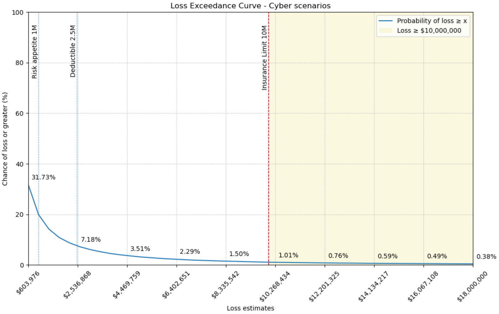

# Cybersecurity Loss Exceedance Curve (LEC) Workbook 🧠💥

Welcome to the **Cyber LEC Lab** - where Monte Carlo meets mayhem thanks to code adapted from Tim Layton's [How To Program a Cybersecurity Loss Exceedance Curve in Python](https://timlaytoncybersecurity.medium.com/how-to-program-a-cybersecurity-loss-exceedance-curve-in-python-64d90cfa59d3). This Jupyter notebook helps CISOs, risk analysts, and security nerds quantify the unquantifiable: *“What’s the chance we lose more than $X this year?”*  

---

## 🧩 What This Does
This notebook simulates cybersecurity events (like ransomware, BEC, cloud oopsies, and privacy fines) thousands of times using a **Monte Carlo** approach. It then builds a **Loss Exceedance Curve (LEC)** - a visual map of how likely certain loss magnitudes are.  

You’ll end up with answers like:  
- “There’s a 5% chance our annual losses exceed $5M.”  
- “Our insurance limit only covers 70% of plausible tails.”  
- “Cut ransomware probability in half? Here’s what that curve looks like now.”  

---

## ⚙️ How to Run It

1. **Clone this repo**  
   ```bash
   git clone https://github.com/stevensingersec/cyber-lec-workbook.git
   cd cyber-lec-workbook
   ```

2. **Create a conda environment**  
   ```bash
   conda create -n cyberlec python=3.11 -y
   conda activate cyberlec
   ```

3. **Install dependencies**  
   ```bash
   pip install numpy pandas matplotlib jupyter
   ```

4. **Launch the notebook**  
   ```bash
   jupyter notebook
   ```
   Then open **Cyber_LEC_Workbook.ipynb**.  

5. **Run cells in order** (Shift+Enter)  
   - Use the built-in scenarios or your own CSV.  
   - Watch the LEC curve take shape.  
   - Tweak event probabilities and upper/lower bounds.  

---

## 🧮 Example Scenarios
Out of the box, you’ll see events like:  

| Event | Annual Probability | Loss Range (USD) |
|-------|-------------------|------------------|
| Ransomware exfiltration | 5% | $0.36M–$16.8M |
| Business email compromise | 15% | $25K–$600K |
| Privacy fine | 3% | $0.2M–$8M |
| Cloud misconfig | 12% | $80K–$2.5M |

Each run simulates thousands of “years” to produce a probability distribution of total annual losses.

---

## 📈 What You Get
- **Loss Exceedance Curve (LEC)** plot  
- **Percentile summary table** (50th, 75th, 90th, 95th, etc.)  
- **Exceedance probability table** for any thresholds you define  
- **Insurance layer analysis** (deductible, limit, retained loss)  
- **Sensitivity experiments** - e.g. “halve ransomware probability”  


---

## 🧠 Data Sources for Starting Values
All starter probabilities and loss ranges come from public data:  
- IBM Cost of a Data Breach 2025 (avg $4.44M)  
- FBI IC3 2024 Report (BEC, fraud losses)  
- NetDiligence 2024 Cyber Claims Study (claim averages)  
- Verizon DBIR 2025 (ransomware trends)  
- GDPR Enforcement Tracker (privacy fines)

Replace these with your own org’s incident data for realism.

---

## 🎯 Why You’ll Love It
Because spreadsheets lie. Simulations don’t.  
This notebook turns your “gut feel” about cyber loss into a reproducible, defendable model for board decks, insurance negotiations, and risk appetite reviews.

---

## 🧙‍♂️ Fun Extras
- Works great for tabletop exercises (“Roll the dice on ransomware!”).  
- Plug in your own CSV of vendor incidents or cloud audit findings.  
- Combine with Streamlit or Plotly if you want to go full dashboard.  

---

## 📜 License
MIT - use it, break it, fork it, improve it.  

---

## 🪄 Pro Tip
When your CFO asks *“Why are we spending so much on security?”*, just pull up the LEC and point at the 95th percentile. Then say:  
> “Because **this** is what happens when we don’t.”  
